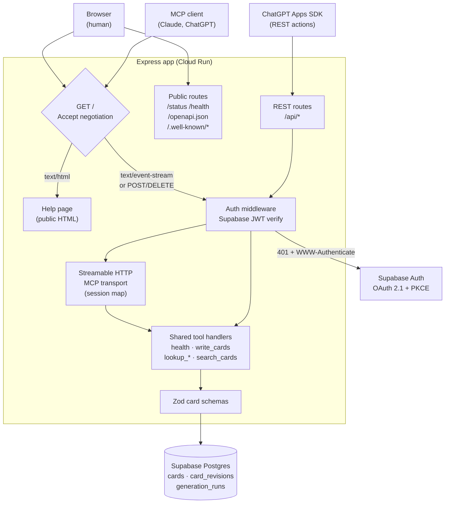
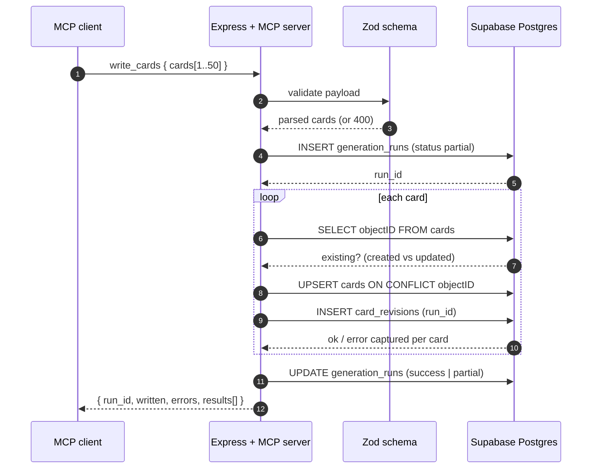

# Supascribe Notes MCP

<!-- prettier-ignore-start -->
<!--START_SECTION:rai-badge-->

<!--END_SECTION:rai-badge-->
<!-- prettier-ignore-end -->

[](https://github.com/anchildress1/supascribe-notes-mcp/actions/workflows/ci.yml)
[](LICENSE)
[](https://conventionalcommits.org)

A TypeScript MCP server that writes index cards to Supabase, deployed on Google Cloud Run.
One service exposes the same seven tools twice — over the Model Context Protocol for MCP
clients, and over REST for the ChatGPT Apps SDK.

---

## Table of Contents

- [About](#about)
- [Features](#features)
- [Tech Stack](#tech-stack)
- [Architecture](#architecture)
- [Project Structure](#project-structure)
- [Getting Started](#getting-started)
- [Configuration](#configuration)
- [Card Shape](#card-shape)
- [Deployment](#deployment)
- [Security](#security)
- [How to Contribute](#how-to-contribute)
- [What's Next](#whats-next)
- [License](#license)
- [Acknowledgements](#acknowledgements)
- [Author](#author)

---

## About

An index card is one durable fact — a decision, a constraint, a thing learned — small enough
to write down and specific enough to find again. This server is the write path for that
corpus.

The problem it solves: an assistant that can only read your notes forgets everything it
figures out with you. Giving a model a general-purpose database connection fixes that and
introduces a much worse problem. So the surface here is deliberately narrow — seven tools,
a validated card shape, revision history on every write, and no ability to drop a table.

Built for a single author's knowledge base, but nothing in it is personal to that use case.
If you want an assistant that accumulates rather than resets, this is the shape of it.

---

## Features

### Nothing gets lost

Cards are never hard-deleted. Deleting one sets a `deleted_at` timestamp and every read path
quietly skips it, but the row and its full history stay in the database — you can always go
looking. Every write also appends to `card_revisions`, so the corpus has a complete audit
trail rather than a series of overwrites.

That history is grouped, too. A `write_cards` call opens a `generation_runs` batch before it
touches anything, which means a run that dies partway through still leaves a record of
exactly what landed and what didn't.

### It tells you when it fails

Batch writes are the easy place to hide problems. This one doesn't: a response reports how
many cards were `written`, how many produced `errors`, and a per-card `error_details` list
naming each failure. Nineteen good cards and one bad one gets you nineteen cards and a
complaint — not a silent twenty-success.

### Two front doors, one set of locks

The same seven capabilities are exposed twice — over MCP streamable HTTP for MCP clients, and
over REST at `/api/*` for the ChatGPT Apps SDK. Both surfaces call the identical handler
functions, so they cannot drift apart as the project changes. Both sit behind the same
Supabase OAuth 2.1 gate, discoverable by clients through standard `.well-known` metadata.

### Built for a model to use safely

Zod schemas validate every card before it reaches Postgres, so malformed input never touches
the database. Dedicated lookup tools for categories, projects, and tags let an assistant
orient itself before writing instead of inventing a taxonomy. And the `tools/list` output is
sanitized on the way out — ChatGPT rejects descriptors containing `$schema` or `default`, so
those keywords are stripped.

### The seven tools

| Tool                | Description                                                         |
| ------------------- | ------------------------------------------------------------------- |
| `health`            | Check server status and Supabase connectivity                       |
| `write_cards`       | Validate and upsert index cards with revision history               |
| `lookup_card_by_id` | Find specific index cards by UUID list (excludes soft-deleted)      |
| `lookup_categories` | Get all unique categories used across active cards                  |
| `lookup_projects`   | Get all unique project identifiers used across active cards         |
| `lookup_tags`       | Get all unique lvl0/lvl1 tags used across active cards              |
| `search_cards`      | Keyword search by category/tag/project/fact (excludes soft-deleted) |

Both batch endpoints cap at 50 per call — 50 cards for `write_cards`, 50 IDs for
`lookup_card_by_id`. Go over and the schema rejects the request rather than silently
truncating it.

---

## Tech Stack

| Layer         | Tools                                                                        |
| ------------- | ---------------------------------------------------------------------------- |
| Runtime       | Node.js 22+, TypeScript 5.7, Express 5, ESM only                             |
| MCP & AI      | `@modelcontextprotocol/sdk`, OpenAI SDK                                      |
| Data          | Supabase (`@supabase/supabase-js`), Postgres with RLS, Zod validation        |
| Logging       | Pino                                                                         |
| Testing       | Vitest, `@vitest/coverage-v8`                                                |
| Quality Gates | ESLint, Prettier, Lefthook, Commitlint + `commitlint-plugin-rai`, secretlint |
| Infra & CI/CD | Google Cloud Run, GitHub Actions, Release Please, SonarCloud                 |

---

## Architecture

One Express app serves three audiences from overlapping routes. The interesting part is the
root route: `/` is simultaneously a public HTML help page and the authenticated MCP endpoint,
resolved by content negotiation rather than by path.



### Write path

`write_cards` opens a generation run before touching any card, so a batch that dies halfway
still leaves an auditable record of what landed.



---

## Project Structure

Almost everything interesting is in `server.ts` — it builds both the Express app and the MCP
server and wires every route. If you're looking for where something happens, start there and
follow it out to `tools/`, which holds the actual work.

```text
src/
  index.ts              # process entrypoint: load config, start server, wire shutdown
  config.ts             # env parsing and required-var enforcement
  server.ts             # Express app + MCP server construction, all route wiring
  middleware/
    auth.ts             # Supabase JWT verification, 401 + WWW-Authenticate challenge
    request-logger.ts   # per-request Pino child logger
  tools/
    health.ts           # connectivity probe
    write-cards.ts      # batch upsert, revision history, generation runs
    lookup-tools.ts     # by-id, categories, projects, tags, search
  schemas/
    card.ts             # Zod card shape, batch limits, search filters
  lib/
    auth-provider.ts    # SupabaseTokenVerifier
    openapi.ts          # OpenAPI spec generation for the Apps SDK surface
    supabase.ts         # service-role client factory
    logger.ts           # Pino instance
    shutdown.ts         # graceful shutdown handlers
  views/
    auth-view.ts        # OAuth consent page
    help-view.ts        # public landing page served at /
supabase/migrations/    # ordered SQL migrations (see supabase/AGENTS.md)
tests/                  # unit + integration suites (see tests/AGENTS.md)
docs/                   # troubleshooting and reference material
```

---

## Getting Started

You need a Supabase project of your own before any of this works — the server is a write path
into a database, and there's no bundled one to fall back on. Everything else is optional
until you deploy.

### Prerequisites

- Node.js 22+
- A Supabase project with the migrations in `supabase/migrations` applied
- Docker, if you want to run it containerized
- Google Cloud CLI (`gcloud`), only if you're deploying to Cloud Run

### Install

```bash
git clone git@github.com:anchildress1/supascribe-notes-mcp.git
cd supascribe-notes-mcp

# Installs dependencies and registers Lefthook git hooks
make install

# Copy the example env and fill in your Supabase credentials
cp .env.example .env
```

### Run

```bash
make dev            # hot-reload dev server on PORT (default 8080)
make test           # full Vitest suite
make test-coverage  # suite + coverage report
make lint           # ESLint
make format         # Prettier write
make ai-checks      # everything CI runs, in CI order
```

Verify locally:

```bash
curl http://localhost:8080/status
```

### Database

Apply the migrations in `supabase/migrations` using the Supabase CLI or the SQL editor.
Keep RLS enabled and re-run the Supabase linter if you touch policies — see
[`supabase/AGENTS.md`](supabase/AGENTS.md) for migration conventions.

---

## Configuration

| Variable                    | Required | Default                 | Description                                                       |
| --------------------------- | -------- | ----------------------- | ----------------------------------------------------------------- |
| `SUPABASE_URL`              | ✅       | —                       | Supabase project URL                                              |
| `SUPABASE_SERVICE_ROLE_KEY` | ✅       | —                       | Service role key used for all server-side data access             |
| `SUPABASE_ANON_KEY`         | ✅       | —                       | Anon key, injected into the browser-facing consent page           |
| `PORT`                      | ❌       | `8080`                  | HTTP listen port (0–65535)                                        |
| `PUBLIC_URL`                | ❌       | `http://localhost:PORT` | Public origin for OAuth metadata and MCP transport endpoints      |
| `SERVER_VERSION`            | ❌       | `1.0.0`                 | Version hint for MCP/OpenAPI client cache busting                 |
| `CORS_ORIGINS`              | ❌       | —                       | Comma-separated extra allowed origins; `PUBLIC_URL` is always one |
| `SUPABASE_ACCESS_TOKEN`     | ❌       | —                       | Supabase CLI/MCP token — only needed to apply remote migrations   |

> `PUBLIC_URL` is optional but effectively required in any deployed environment: it seeds the
> OAuth discovery documents and the CORS allowlist. Leave it unset in production and clients
> will be told to authenticate against `localhost`.

When adding or changing tools, bump `SERVER_VERSION` before deploying so ChatGPT refreshes its
cached tool metadata.

### Authentication

All MCP operations and `/api/*` routes require a Supabase-issued Bearer token. MCP clients
discover the OAuth configuration automatically via:

- `/.well-known/oauth-authorization-server`
- `/.well-known/oauth-protected-resource`

The MCP `initialize` response returns an `Mcp-Session-Id` header. Send that header on every
subsequent MCP request in the session.

### REST endpoints (ChatGPT Apps SDK)

The OpenAPI surface at `/openapi.json` exposes:

- `POST /api/write-cards`
- `POST /api/lookup-card-by-id` — expects `{ "ids": ["<uuid>", "<uuid>"] }`
- `GET /api/lookup-categories`
- `GET /api/lookup-projects`
- `GET /api/lookup-tags`
- `POST /api/search-cards`

---

## Card Shape

```json
{
  "objectID": "uuid (auto-generated when omitted)",
  "title": "string (required)",
  "blurb": "string (required)",
  "fact": "string (required)",
  "url": "string (optional, must be a valid URL)",
  "tags": { "lvl0": ["string"], "lvl1": ["string"] },
  "projects": ["string"],
  "category": "string (required)",
  "signal": "number 1–10 (required)",
  "created_at": "timestamptz (optional input for historical imports; normalized on write)",
  "updated_at": "timestamptz (auto)",
  "deleted_at": "timestamptz (optional soft-delete timestamp; omit to leave deletion status unchanged)"
}
```

Both `tags.lvl0` and `tags.lvl1` are required arrays — pass `[]` rather than omitting them.

---

## Deployment

```bash
# Build and run locally in Docker
docker build -t supascribe-notes-mcp .
docker run -p 8080:8080 --env-file .env supascribe-notes-mcp

# Deploy to Cloud Run
gcloud config set project anchildress1-unstable
bash deploy.sh
```

Verify a deployment:

```bash
SERVICE_URL="https://your-service-url"

# Public health check
curl "$SERVICE_URL/status"

# Authenticated MCP initialize — replace YOUR_TOKEN with a valid Supabase JWT
curl -i -X POST \
  -H "Authorization: Bearer YOUR_TOKEN" \
  -H "Accept: application/json, text/event-stream" \
  -H "Content-Type: application/json" \
  --data '{"jsonrpc":"2.0","id":1,"method":"initialize","params":{"protocolVersion":"2025-03-26","capabilities":{},"clientInfo":{"name":"curl","version":"1.0.0"}}}' \
  "$SERVICE_URL"
```

Tools not showing up in ChatGPT? See
[`docs/troubleshoot-tools.md`](docs/troubleshoot-tools.md).

---

## Security

The threat model here is simple: this thing has write access to a personal knowledge base and
is driven by a language model. Both halves of that sentence are reasons to be careful, so the
following are load-bearing rather than decorative. If you're changing any of them, that's the
part of a PR that gets read closely.

- **OAuth-gated for MCP + API calls.** MCP protocol requests (to `/` when negotiated as MCP)
  and `/api/*` endpoints require a Supabase-issued Bearer token; missing or invalid tokens
  return a 401 plus a `WWW-Authenticate` challenge. MCP always gets a plain-text 401 rather
  than the browser-friendly HTML page, so clients can discover the OAuth flow. Browser-facing
  routes (help page, `/auth/authorize`, `/health`, `/status`, `/openapi.json`, and
  `/.well-known/*`) are intentionally public.
- **CORS is an allowlist, not a wildcard.** Only `PUBLIC_URL` and any origins named in
  `CORS_ORIGINS` are accepted; malformed origins are logged and dropped.
- **Input handled like it's hostile.** `authorization_id` is regex-constrained to a safe token
  shape and URL-encoded before it is ever interpolated into a redirect. Config values injected
  into the consent page's inline script are escaped against `</script>` breakout.
- **RLS enforced at the database.** Row-Level Security stays on for every table. Read
  [`supabase/AGENTS.md`](supabase/AGENTS.md) before touching policies.
- **No secrets in the repo.** `secretlint` runs in CI and in Lefthook's pre-commit hook,
  before a commit can land.
- **No hard deletes.** Cards carry `deleted_at`; the write path can soft-delete but nothing
  in the tool surface can destroy a row or a revision.

---

## How to Contribute

Branch off `main` and open a PR — nothing lands on `main` directly. Before you push, run
`make ai-checks`; it runs exactly what CI runs, so if it passes locally you've already cleared
the gate, including the 85% business-logic coverage floor.

Two things about commits will bite you if nobody warns you first. They follow
[Conventional Commits](https://conventionalcommits.org), which is unremarkable, and they must
also carry an AI-attribution footer — `Generated-by:` or `Assisted-by:` naming the model, or
nothing at all if you wrote it yourself. That second rule is enforced by
`commitlint-plugin-rai` in a Lefthook hook, so a missing footer fails at commit time rather
than in review. Commits are signed too (`git commit -S`).

If you're touching tests, migrations, or documentation, read the `AGENTS.md` in that directory
first. They're written for AI agents rather than for you, so they're blunt and skimmable —
but they're also where the non-obvious rules live, like why views must re-declare their
security options on every `CREATE OR REPLACE`.

Three workflows run on this repo: **CI** (lint, test with coverage, secrets scan, build),
**Release Please** (conventional-commit driven versioning), and **RAI Attribution**, which
scores the attribution footers across history and rewrites the badge at the top of this file.

---

## What's Next

The obvious gap is the embedded UI. Tools already declare `_meta.ui.visibility`, which is half
of what an Apps SDK app needs, but none of them declare a `_meta.ui.resourceUri` — so cards
come back as text rather than as anything you can look at. A rendered card surface in the
ChatGPT composer is the next real feature.

Less exciting but genuinely annoying: the migrations directory carries two naming conventions
at once. The early files use `NNN_description.sql` and everything since uses a timestamp
prefix, which makes ordering ambiguous at a glance. Worth normalizing before the list gets
longer.

---

## License

[PolyForm Shield 1.0.0, with Additional Terms](LICENSE).

Translated from lawyer: take it, fork it, run it, learn from it, build your own thing on top
of it. Use it at work, use it for client projects, use it to teach. All fine, all
encouraged.

Two things it forbids. You may not build something that **competes** with this software or
with anything I build using it — that one is Shield's. And you may not **make money** off
it: no reselling, no paid SaaS, no charging for it or its derivatives — that one is mine,
and it is the reason this is not plain Shield. Fork it publicly and you also owe an
attribution line back here.

Both are waivable in writing. If you want to do either, ask — the address is at the bottom
of [LICENSE](LICENSE).

---

## Acknowledgements

- [Model Context Protocol](https://modelcontextprotocol.io) and the TypeScript SDK team
- [Supabase](https://supabase.com) for auth, Postgres, and RLS that behaves
- [PolyForm Project](https://polyformproject.org) for licenses that read like sentences
- [OpenAI Apps SDK](https://developers.openai.com/apps-sdk/reference/) documentation, which
  made the ChatGPT tool-descriptor requirements figure-out-able

---

## Author

**Ashley Childress** — [GitHub](https://github.com/anchildress1) ·
[LinkedIn](https://linkedin.com/in/anchildress1) · [DEV.to](https://dev.to/anchildress1)
